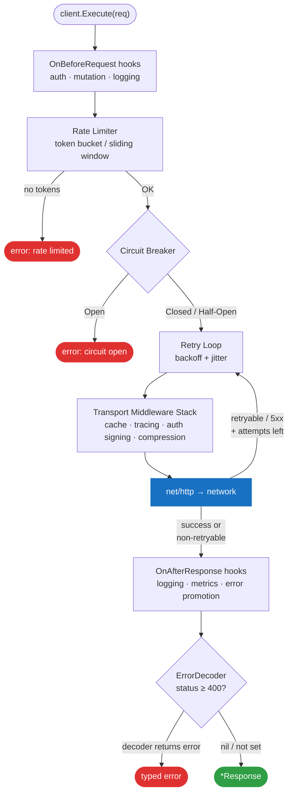
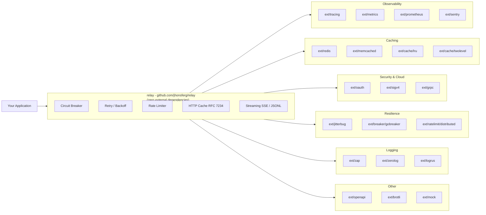
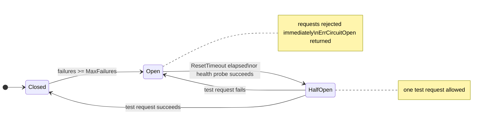
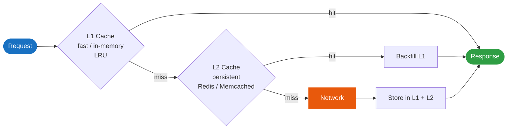
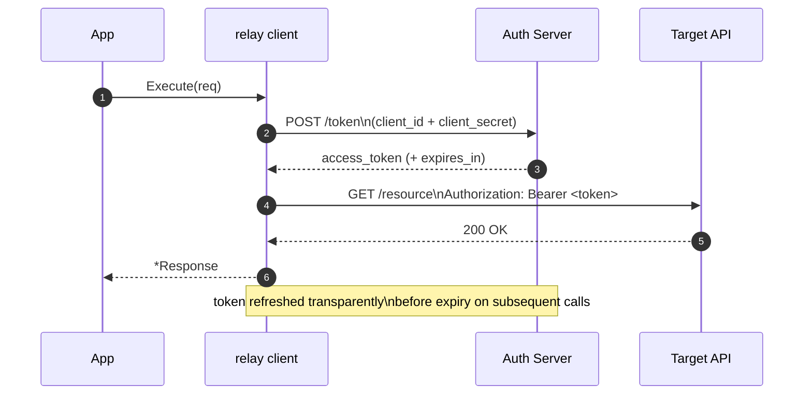

<div align="center">

# Relay

**A production-grade, declarative HTTP client for Go with the ergonomics of Python's *requests* and the resilience of *Resilience4j*.**

[](https://pkg.go.dev/github.com/jhonsferg/relay)
[](https://github.com/jhonsferg/relay/actions/workflows/ci.yml)
[](https://github.com/jhonsferg/relay/actions/workflows/ci.yml)
[](https://codecov.io/gh/jhonsferg/relay)
[](https://github.com/jhonsferg/relay/actions/workflows/codeql.yml)
[](https://github.com/jhonsferg/relay/actions/workflows/trivy.yml)
[](https://github.com/jhonsferg/relay/actions/workflows/api-check.yml)
[](https://github.com/jhonsferg/relay/actions/workflows/license-check.yml)
[](https://github.com/jhonsferg/relay/releases/latest)
[](https://pkg.go.dev/github.com/jhonsferg/relay)
[](https://goreportcard.com/report/github.com/jhonsferg/relay)
[](LICENSE)

---

**[Installation](#-installation) • [Quick Start](#-quick-start) • [Core Features](#-core-features) • [Extensions](#-extension-ecosystem) • [Testing](#-testing) • [Examples](#-examples) • [Performance](#-performance)**

</div>

## Overview

**Relay** is designed for developers who need more than just `http.Client`. It provides a fluent, batteries-included API for building resilient distributed systems. Retries, circuit breaking, caching, rate limiting, streaming, and observability are all built in - allowing you to focus on your business logic.

The core module has **zero external dependencies**. Every integration (Redis, OTel, Prometheus, gRPC, etc.) lives in its own optional extension module so you only pull in what you actually use.

---

## Architecture

### Request / Response Lifecycle



Every layer is opt-in via `relay.Option` - compose exactly the behaviour your service needs.

### Extension Ecosystem



---

## Installation

```bash
go get github.com/jhonsferg/relay
```

Pick only the extensions you need:

```bash
# Observability
go get github.com/jhonsferg/relay/ext/tracing        # OpenTelemetry tracing
go get github.com/jhonsferg/relay/ext/metrics        # OpenTelemetry metrics
go get github.com/jhonsferg/relay/ext/prometheus     # Native Prometheus metrics
go get github.com/jhonsferg/relay/ext/sentry         # Sentry error reporting

# Caching
go get github.com/jhonsferg/relay/ext/redis          # Redis cache backend
go get github.com/jhonsferg/relay/ext/memcached      # Memcached cache backend
go get github.com/jhonsferg/relay/ext/cache/lru      # In-memory LRU cache
go get github.com/jhonsferg/relay/ext/cache/twolevel # Two-level (L1+L2) cache

# Security & Cloud
go get github.com/jhonsferg/relay/ext/oauth          # OAuth 2.0 Client Credentials
go get github.com/jhonsferg/relay/ext/sigv4          # AWS Signature V4
go get github.com/jhonsferg/relay/ext/grpc           # gRPC-Gateway metadata

# Resilience
go get github.com/jhonsferg/relay/ext/jitterbug               # Advanced backoff strategies
go get github.com/jhonsferg/relay/ext/breaker/gobreaker       # sony/gobreaker circuit breaker
go get github.com/jhonsferg/relay/ext/ratelimit/distributed   # Redis sliding-window rate limiter

# Logging
go get github.com/jhonsferg/relay/ext/zap      # go.uber.org/zap adapter
go get github.com/jhonsferg/relay/ext/zerolog  # rs/zerolog adapter
go get github.com/jhonsferg/relay/ext/logrus   # sirupsen/logrus adapter

# Validation & Interop
go get github.com/jhonsferg/relay/ext/openapi  # OpenAPI 3.x request/response validation

# Compression
go get github.com/jhonsferg/relay/ext/brotli   # Brotli decompression

# Testing
go get github.com/jhonsferg/relay/ext/mock     # Programmable mock transport
```

---

## Quick Start

```go
package main

import (
    "fmt"
    "time"

    "github.com/jhonsferg/relay"
)

type User struct {
    ID   int    `json:"id"`
    Name string `json:"name"`
}

func main() {
    client := relay.New(
        relay.WithBaseURL("https://api.example.com"),
        relay.WithTimeout(10*time.Second),
        relay.WithRetry(&relay.RetryConfig{MaxAttempts: 3}),
    )

    // Typed JSON decode with generics
    user, resp, err := relay.ExecuteAs[User](client, client.Get("/users/42"))
    if err != nil {
        panic(err)
    }

    fmt.Printf("%d %s - fetched in %v\n", user.ID, user.Name, resp.Timing.Total)
}
```

---

## Core Features

### Request Building

Relay's fluent builder covers every HTTP scenario without boilerplate:

```go
resp, err := client.Post("/orders/{id}").
    WithPathParam("id", "ord-42").
    WithHeader("X-Idempotency-Key", "req-abc").
    WithQueryParam("expand", "items").
    WithJSON(orderPayload).
    WithTimeout(5 * time.Second).
    WithTag("operation", "CreateOrder").   // client-side label, not sent
    Execute()
```

**Supported body types**

| Method | Content-Type |
|--------|-------------|
| `WithJSON(v)` | `application/json` |
| `WithFormData(map)` | `application/x-www-form-urlencoded` |
| `WithMultipart(fields)` | `multipart/form-data` |
| `WithBody([]byte)` | *(caller sets Content-Type)* |
| `WithBodyReader(r)` | *(caller sets Content-Type)* |

### Request Cloning

Clone a base request and vary headers, params, or bodies without re-building from scratch:

```go
base := client.Post("/events").
    WithHeader("Content-Type", "application/json").
    WithTag("service", "billing")

for _, event := range events {
    req := base.Clone().WithJSON(event)
    go client.Execute(req)
}
```

### Per-Request Body Size Limit

Override the client-level limit for a single request:

```go
// Allow up to 50 MB for this download
resp, err := client.Execute(
    client.Get("/reports/large.csv").WithMaxBodySize(50 << 20),
)

// No limit at all for this specific request
resp, err = client.Execute(
    client.Get("/stream").WithMaxBodySize(-1),
)
```

### Resilience

#### Exponential Backoff Retries

```go
relay.WithRetry(&relay.RetryConfig{
    MaxAttempts:     4,
    InitialInterval: 100 * time.Millisecond,
    MaxInterval:     30 * time.Second,
    Multiplier:      2.0,
    RetryableStatus: []int{429, 502, 503, 504},
})
```

#### Circuit Breaker



```go
relay.WithCircuitBreaker(&relay.CircuitBreakerConfig{
    MaxFailures:  5,
    ResetTimeout: 30 * time.Second,
    OnStateChange: func(from, to relay.CircuitBreakerState) {
        log.Printf("circuit: %s -> %s", from, to)
    },
})
```

#### Automatic Health Check Recovery

When the circuit breaker opens, a background goroutine probes a health endpoint and
resets the breaker automatically without waiting for `ResetTimeout`:

```go
relay.WithHealthCheck(
    "https://api.example.com/health", // probe URL
    5*time.Second,                    // poll interval
    2*time.Second,                    // probe timeout
    200,                              // expected status
)
```

#### Client-Side Rate Limiting

```go
relay.WithRateLimit(100, time.Second) // 100 requests per second
```

### DNS Caching

Reduce resolver latency on high-concurrency workloads by caching DNS results:

```go
relay.WithDNSCache(30 * time.Second) // cache each hostname for 30 s
```

IP-literal addresses bypass the cache. Cache entries are refreshed lazily on expiry.

### Streaming

#### Server-Sent Events (SSE)

```go
err := client.ExecuteSSE(
    client.Get("/events").WithHeader("Accept", "text/event-stream"),
    func(event relay.SSEEvent) bool {
        fmt.Printf("[%s] %s\n", event.Event, event.Data)
        return true // return false to stop
    },
)
```

`SSEEvent` carries `ID`, `Event`, `Data`, and `Retry` fields per the W3C spec.
Multi-line `data:` fields are concatenated with `\n`.

#### JSONL / NDJSON Streaming

```go
err := relay.ExecuteAsStream[LogEntry](client, client.Get("/logs"), func(entry LogEntry) bool {
    fmt.Println(entry.Message)
    return entry.Level != "FATAL" // stop on fatal
})
```

Each newline-delimited JSON line is decoded directly into `T` without buffering the full body.

#### Raw Streaming

```go
stream, err := client.ExecuteStream(client.Get("/video"))
defer stream.Body.Close()
io.Copy(dst, stream.Body)
```

### Caching (Built-in)

Relay implements RFC 7234 HTTP caching semantics. Plug in any `CacheStore`:

```go
client := relay.New(
    relay.WithCache(store),              // any CacheStore implementation
    relay.WithCacheMaxAge(5*time.Minute), // global TTL override
)
```

Conditional requests (`ETag`, `Last-Modified`) and `Cache-Control` directives are
handled automatically.

### Request Coalescing

Collapse concurrent identical GET requests into a single upstream call:

```go
relay.WithCoalescing() // multiple goroutines get the same response
```

### Response Timing

```go
resp, _ := client.Execute(req)
t := resp.Timing

fmt.Printf(
    "DNS: %v  TCP: %v  TLS: %v  TTFB: %v  Total: %v\n",
    t.DNSLookup, t.TCPConnection, t.TLSHandshake, t.ServerProcessing, t.Total,
)
```

### Hooks

#### Request and Response Hooks

```go
client := relay.New(
    relay.WithOnBeforeRequest(func(ctx context.Context, req *relay.Request) error {
        req.WithHeader("X-Request-ID", uuid.New().String())
        return nil
    }),
    relay.WithOnAfterResponse(func(ctx context.Context, resp *relay.Response) error {
        metrics.RecordLatency(resp.Timing.Total)
        return nil
    }),
)
```

Hooks receive `req.Method()`, `req.URL()`, and `req.Tag(key)` for routing decisions
without needing to inspect the raw `*http.Request`.

#### Error Decoder

Translate HTTP error codes into typed Go errors without boilerplate status checks at
every call site. Inspired by OpenFeign's `ErrorDecoder`:

```go
var (
    ErrNotFound      = errors.New("not found")
    ErrUnauthorised  = errors.New("unauthorised")
    ErrRateLimited   = errors.New("rate limited")
)

client := relay.New(
    relay.WithErrorDecoder(func(status int, body []byte) error {
        switch status {
        case http.StatusNotFound:
            return ErrNotFound
        case http.StatusUnauthorized:
            return fmt.Errorf("%w: %s", ErrUnauthorised, body)
        case http.StatusTooManyRequests:
            return ErrRateLimited
        }
        return nil // nil = return *Response normally for this status
    }),
)

_, err := client.Execute(client.Get("/users/123"))
if errors.Is(err, ErrNotFound) {
    // handle 404 cleanly - no status code checks needed at the call site
}
```

The decoder runs **after** all `OnAfterResponse` hooks. Returning `nil` for a status
preserves the default behaviour (the `*Response` is returned without error).

---

### Transport Customisation

#### HTTP/3 / QUIC

HTTP/3 support is available via transport middleware - relay's zero-dependency core
does not bundle `quic-go`. Add it to your own module and plug it in via
`WithTransportMiddleware`:

```go
import (
    "github.com/quic-go/quic-go/http3"
    "github.com/jhonsferg/relay"
)

client := relay.New(
    relay.WithTransportMiddleware(func(_ http.RoundTripper) http.RoundTripper {
        return &http3.RoundTripper{
            TLSClientConfig: &tls.Config{
                InsecureSkipVerify: false,
            },
        }
    }),
)
```

`WithTransportMiddleware` accepts any `http.RoundTripper`, so any custom transport -
QUIC, Unix sockets, in-memory test transports, or protocol-specific clients - can be
injected without modifying relay's core.

---

## Extension Ecosystem

### Observability & Monitoring

#### OpenTelemetry Tracing (`ext/tracing`)

Automatic W3C TraceContext propagation, span creation, and HTTP attribute recording:

```go
import relaytracing "github.com/jhonsferg/relay/ext/tracing"

client := relay.New(
    relaytracing.WithTracing(tracerProvider, propagator),
)
```

#### OpenTelemetry Metrics (`ext/metrics`)

Records `request_count`, `request_duration_ms`, and `active_requests`:

```go
import relaymetrics "github.com/jhonsferg/relay/ext/metrics"

client := relay.New(
    relaymetrics.WithOTelMetrics(meterProvider),
)
```

#### Prometheus (`ext/prometheus`)

Native Prometheus histograms and counters without the OTel SDK:

```go
import relayprom "github.com/jhonsferg/relay/ext/prometheus"

client := relay.New(
    relayprom.WithPrometheus(prometheus.DefaultRegisterer, "myapp"),
)
```

#### Sentry (`ext/sentry`)

Capture network failures and 5xx responses as Sentry events with full HTTP context:

```go
import relaysentry "github.com/jhonsferg/relay/ext/sentry"

client := relay.New(
    relaysentry.WithSentry(sentry.CurrentHub()),
    relaysentry.WithCaptureClientErrors(true), // also capture 4xx
)
```

---

### Caching Backends

#### Redis (`ext/redis`)

Share cached responses across multiple service instances:

```go
import relayredis "github.com/jhonsferg/relay/ext/redis"

store := relayredis.NewCacheStore(redisClient, "relay:cache:")
client := relay.New(relay.WithCache(store))
```

Entries are serialized as JSON. `Clear()` uses `SCAN + DEL` with the key prefix,
never `FLUSHDB`.

#### Memcached (`ext/memcached`)

```go
import relaymemcached "github.com/jhonsferg/relay/ext/memcached"

store := relaymemcached.NewCacheStore(memcacheClient, "relay:")
client := relay.New(relay.WithCache(store))
```

#### In-Memory LRU Cache (`ext/cache/lru`)

Zero-dependency in-process cache with O(1) eviction:

```go
import relaycachelru "github.com/jhonsferg/relay/ext/cache/lru"

store := relaycachelru.New(1000) // capacity: 1000 entries
client := relay.New(relay.WithCache(store))
```

#### Two-Level Cache (`ext/cache/twolevel`)

Combine a fast L1 (e.g. LRU) with a persistent L2 (e.g. Redis). L1 misses that hit
L2 are automatically backfilled into L1:



```go
import (
    relaycachelru "github.com/jhonsferg/relay/ext/cache/lru"
    relaytwolevel "github.com/jhonsferg/relay/ext/cache/twolevel"
)

l1 := relaycachelru.New(500)
l2 := relayredis.NewCacheStore(rdb, "relay:")

store := relaytwolevel.New(l1, l2)
client := relay.New(relay.WithCache(store))
```

---

### Security & Cloud

#### OAuth 2.0 Client Credentials (`ext/oauth`)

Automatic token fetch and transparent background refresh for M2M auth:



```go
import relayoauth "github.com/jhonsferg/relay/ext/oauth"

client := relay.New(
    relayoauth.WithClientCredentials(relayoauth.Config{
        TokenURL:     "https://auth.example.com/oauth/token",
        ClientID:     os.Getenv("CLIENT_ID"),
        ClientSecret: os.Getenv("CLIENT_SECRET"),
        Scopes:       []string{"api:read", "api:write"},
    }),
)
```

#### AWS Signature V4 (`ext/sigv4`)

Sign requests for any AWS service (S3, DynamoDB, API Gateway, ...):

```go
import relaysigv4 "github.com/jhonsferg/relay/ext/sigv4"

client := relay.New(
    relaysigv4.WithSigV4(relaysigv4.Config{
        Region:  "us-east-1",
        Service: "execute-api",
    }),
)
```

#### gRPC-Gateway Metadata (`ext/grpc`)

Bridge relay clients to gRPC-Gateway proxies by adding `Grpc-Metadata-*` headers
without importing any gRPC or protobuf packages:

```go
import relaygrpc "github.com/jhonsferg/relay/ext/grpc"

client := relay.New(
    relay.WithBaseURL("https://grpc-gateway.example.com"),
    relaygrpc.WithMetadata("x-tenant-id", tenantID),
    relaygrpc.WithTimeoutHeader(), // forwards context deadline as Grpc-Timeout
)

// Per-request binary metadata (base64-encoded, -Bin suffix)
req := relaygrpc.SetBinaryMetadata("x-signature", sigBytes)(client.Post("/v1/orders"))
```

Parse metadata echoed back in responses:

```go
meta, err := relaygrpc.ParseMetadata(resp.Header)
```

---

### Resilience

#### Advanced Backoff Strategies (`ext/jitterbug`)

Drop-in replacement for the built-in exponential backoff:

```go
import relayjitter "github.com/jhonsferg/relay/ext/jitterbug"

client := relay.New(
    relay.WithRetry(&relay.RetryConfig{
        MaxAttempts: 5,
        Backoff:     relayjitter.NewDecorrelatedJitter(100*time.Millisecond, 30*time.Second),
    }),
)
```

Available strategies: `DecorrelatedJitter`, `LinearBackoff`, retry budget.

#### sony/gobreaker Circuit Breaker (`ext/breaker/gobreaker`)

Plug in the battle-tested [gobreaker](https://github.com/sony/gobreaker) library:

```go
import relaybreaker "github.com/jhonsferg/relay/ext/breaker/gobreaker"

cb := relaybreaker.NewCircuitBreaker(gobreaker.Settings{
    Name:        "payments-api",
    MaxRequests: 3,
    Interval:    10 * time.Second,
    Timeout:     30 * time.Second,
})

client := relay.New(
    relaybreaker.WithGoBreaker(cb),
)
```

HTTP 5xx responses are counted as failures; the response is still returned to the
caller so your application can decide how to handle it.

#### Distributed Rate Limiter (`ext/ratelimit/distributed`)

Redis sliding-window rate limiter with atomic Lua script - safe across multiple
service replicas:

```go
import relaydist "github.com/jhonsferg/relay/ext/ratelimit/distributed"

limiter := relaydist.New(
    redisClient,
    "my-service:rate",   // Redis key prefix
    100,                 // max requests
    time.Minute,         // window
)

client := relay.New(
    relaydist.WithRateLimit(limiter),
)
```

Fails open on Redis errors to avoid taking down your service when the rate limiter
itself is unavailable.

---

### Logging

All adapters implement the same `relay.Logger` interface:

```go
type Logger interface {
    Debug(msg string, args ...any)
    Info(msg string, args ...any)
    Warn(msg string, args ...any)
    Error(msg string, args ...any)
}
```

#### go.uber.org/zap (`ext/zap`)

```go
import relayzap "github.com/jhonsferg/relay/ext/zap"

client := relay.New(
    relay.WithLogger(relayzap.NewAdapter(zapLogger)),
    // or: relayzap.NewSugaredAdapter(sugar)
)
```

#### rs/zerolog (`ext/zerolog`)

```go
import relayzl "github.com/jhonsferg/relay/ext/zerolog"

client := relay.New(
    relay.WithLogger(relayzl.NewAdapter(zerologLogger)),
)
```

#### sirupsen/logrus (`ext/logrus`)

```go
import relaylogrus "github.com/jhonsferg/relay/ext/logrus"

client := relay.New(
    relay.WithLogger(relaylogrus.NewAdapter(logrus.StandardLogger())),
    // or: relaylogrus.NewEntryAdapter(entry) for pre-set fields
)
```

---

### OpenAPI Validation (`ext/openapi`)

Validate every request - and optionally every response - against an OpenAPI 3.x spec
before it reaches the network. Route mismatches are passed through (the server will 404).

```go
import relayopenapi "github.com/jhonsferg/relay/ext/openapi"

doc, err := relayopenapi.LoadFile("openapi.yaml")
if err != nil {
    log.Fatal(err)
}

client := relay.New(
    relay.WithBaseURL("https://api.example.com"),
    relayopenapi.WithValidation(doc,
        relayopenapi.WithResponseValidation(), // also validate responses
        relayopenapi.WithStrict(),             // reject unknown query params/headers
    ),
)

// Check for validation errors
if _, err := client.Execute(req); err != nil {
    if ve, ok := relayopenapi.IsValidationError(err); ok {
        log.Printf("OpenAPI %s validation failed: %v", ve.Phase, ve.Cause)
    }
}
```

---

### Compression

#### Brotli (`ext/brotli`)

Transparent `br` decompression - advertises `Accept-Encoding: br` and decompresses
the response body automatically:

```go
import relaybr "github.com/jhonsferg/relay/ext/brotli"

client := relay.New(relaybr.WithBrotliDecompression())
```

---

## Testing

### testutil - Mock HTTP Server

The built-in `testutil` package provides a mock HTTP server for unit tests without
needing to set up a real server:

```go
import "github.com/jhonsferg/relay/testutil"

func TestMyAPI(t *testing.T) {
    srv := testutil.NewMockServer()
    defer srv.Close()

    srv.Enqueue(testutil.MockResponse{
        Status: 200,
        Body:   `{"status":"ok"}`,
    })

    client := relay.New(relay.WithBaseURL(srv.URL()))
    resp, _ := client.Execute(client.Get("/health"))

    req, _ := srv.TakeRequest(time.Second)
    if req.URL.Path != "/health" {
        t.Errorf("unexpected path: %s", req.URL.Path)
    }
}
```

### ext/mock - Programmable Transport

For unit tests that should never touch the network, `ext/mock` intercepts all
requests inside the process:

```go
import relaymock "github.com/jhonsferg/relay/ext/mock"

mt := relaymock.New(t).
    On(relaymock.GET("/users/1")).Respond(200, `{"id":1,"name":"Alice"}`).
    On(relaymock.POST("/users")).RespondSeq(
        relaymock.Seq(201, `{"id":2}`, nil),
        relaymock.Seq(409, `{"error":"duplicate"}`, nil),
    ).
    Default(relaymock.Respond(503, `{"error":"unavailable"}`))

client := relay.New(relaymock.WithMock(mt))

// Make requests - no network calls are made
resp, _ := client.Execute(client.Get("/users/1"))
mt.AssertExpectations() // verify all rules were hit
```

Rules support exact URL, method, path prefix, and custom predicate matchers.

---

## URL Normalization & RFC 3986 Compliance

Relay automatically handles URL resolution with intelligent strategy selection to work correctly with both host-only URLs and API endpoints with path components.

### The Problem

RFC 3986's standard URL resolution treats "/" as an absolute path reference that replaces the entire base path:

```go
// Without Relay (RFC 3986 alone)
base := "http://api.example.com/v1"
path := "/Products"
// Result: "http://api.example.com/Products"  ❌ Lost /v1!
```

### The Solution: Smart Detection (Phase 1-4)

Relay uses **intelligent strategy selection**:

```go
// With Relay
client := relay.New(relay.WithBaseURL("http://api.example.com/v1"))
resp, _ := client.Get("/Products")
// Result: "http://api.example.com/v1/Products"  ✅ Correct!
```

**Phase 1: Smart Detection**
- Detects API patterns (`/v1`, `/odata`, `/api`, etc.)
- Uses RFC 3986 for host-only URLs (zero-alloc)
- Uses safe string concatenation for API URLs (preserves paths)

**Phase 2: Configuration Modes**
- `NormalizationAuto` (default) - Intelligent detection
- `NormalizationRFC3986` - Force standards compliance
- `NormalizationAPI` - Force path preservation

```go
client := relay.New(
    relay.WithBaseURL("http://api.example.com/v1"),
    relay.WithURLNormalization(relay.NormalizationAPI),
)
```

**Phase 3: Auto-Normalization**
- Automatically adds trailing slashes to base URLs
- Enabled by default; can be disabled with `WithAutoNormalizeURL(false)`

**Phase 4: Helper Utilities**
- `PathBuilder` - Fluent path construction
- `ResolveTest` - Debug URL resolution without HTTP calls

### Common Usage Patterns

```go
// Simple API
client := relay.New(
    relay.WithBaseURL("http://api.example.com/v1"),
)
resp, _ := client.Get("/users/123")

// PathBuilder for clean paths
path := relay.NewPathBuilder("/api/v1").
    Add("users").
    Add(userID).
    Add("posts").
    String()

// Debug URL resolution
config := client.Config()
result := relay.ResolveTest("http://api.example.com/v1", "/users", config)
fmt.Println(result.URL)       // Resolved URL
fmt.Println(result.Strategy)  // "Auto" or "RFC3986" or "API"
```

### Learn More

See `doc/RFC3986.md` for a comprehensive guide including:
- Why RFC 3986 breaks API URLs
- When each strategy is used
- Performance characteristics
- Migration from manual URL handling

---

## Examples

The `examples/` directory contains runnable programs demonstrating every feature:

| Directory | What it shows |
|-----------|--------------|
| `examples/basic/` | Simple GET/POST, query params, path params, JSON decode |
| `examples/retry/` | Exponential backoff, custom retry predicate |
| `examples/circuit_breaker/` | Trip -> open -> reset cycle |
| `examples/healthcheck/` | Automatic circuit breaker recovery via health probe |
| `examples/dns_cache/` | DNS result caching with concurrency and TTL demo |
| `examples/sse/` | Server-Sent Events streaming with multi-line data |
| `examples/jsonl_stream/` | JSONL/NDJSON streaming with `ExecuteAsStream[T]` |
| `examples/streaming/` | Raw response body streaming |
| `examples/tls_pinning/` | Certificate pinning (correct/wrong/rotation) |
| `examples/digest_auth/` | HTTP Digest Authentication challenge/response |
| `examples/progress/` | Upload and download progress bars |
| `examples/coalescing/` | Request deduplication - hit counter shows upstream savings |
| `examples/async/` | `ExecuteAsync`, fan-out, first-to-respond, map-reduce |
| `examples/middleware/` | Transport middleware chain, `OnBeforeRequest`, `OnAfterResponse` |
| `examples/batch/` | Batch execution with `ExecuteBatch` |
| `examples/redis/` | Redis-backed cache with miss/hit/TTL/Clear |
| `examples/redis_cache/` | Cache invalidation and conditional requests |
| `examples/otel/` | OpenTelemetry end-to-end (traces + metrics) |
| `examples/prometheus/` | Prometheus scrape endpoint wiring |
| `examples/zap_logger/` | go.uber.org/zap adapter usage |
| `examples/zerolog_logger/` | rs/zerolog adapter usage |
| `examples/oauth2/` | OAuth 2.0 Client Credentials flow |
| `examples/har_recording/` | HAR 1.2 traffic capture and export |
| `api_client.go` | Type-safe API client patterns, PathBuilder, error handling |
| `uri_standard.go` | RFC 3986 compliance, smart URL resolution, configuration modes |

Run any example:

```bash
cd examples/sse && go run .
```

---

## Performance

Relay is built for high-throughput services:

- **Zero-allocation pooling** - `sync.Pool` for internal buffers keeps GC pressure low.
- **Request coalescing** - collapses identical concurrent requests into a single upstream call, eliminating thundering-herd on cache warm-up.
- **Optimized transport** - pre-tuned connection pool with keep-alive and native HTTP/2 support.
- **Lazy body sizing** - response bodies are read into a capped buffer; oversized responses are rejected early without allocating.
- **DNS caching** - optional client-side DNS cache eliminates repeated resolver round-trips for long-lived services.
- **Allocation tuning** - micro-optimisations in hot paths; 104 allocs/op for `Execute` (90 allocs/op with `WithDisableTiming()`).

### Benchmark Results

Run benchmarks with:

```bash
# Core Execute benchmarks
go test -bench=BenchmarkExecute -benchmem -count=3 ./benchmarks/common

# Memory allocation patterns
go test -bench=BenchmarkMemory -benchmem -count=3 ./benchmarks/memory

# High-volume data scenarios
go test -bench=Benchmark -benchmem -count=3 ./benchmarks/bigdata

# Hotspot analysis (individual allocation sources)
go test -bench=BenchmarkHotspot -benchmem -count=2 ./benchmarks/hotspots
```

Results on AMD Ryzen 9 5950X (16-core):

| Scenario | Throughput | Latency | Memory | vs Standard |
|----------|-----------|---------|--------|------------|
| Heavy Parallel (50K records) | 288 ops/s | 19.18 ms | 68.4 MB | -8.5% latency, -12.6% memory |
| Memory Stress (100K records) | 60 ops/s | 99.65 ms | 45.1 MB | Linear scaling |
| Small Payload (microservices) | 26,942 ops/s | 217 ns | 9.3 KB | Exceptional throughput |
| Large Stream (250K records) | 54 ops/s | 100 ms | 46.3 MB | Stable at scale |
| Idle Connections (burst pattern) | 224 ops/s | 26.7 ms | 10.6 MB | Smart cleanup |

**Key Metrics:**
- Memory reduction at scale: **-12.6%** vs `net/http`
- Latency improvement in concurrent scenarios: **-8.5%**
- Container capacity gain (4GB limit): **+13.5%** more concurrent requests
- Throughput for small payloads: **26,942 ops/sec**
- Allocation rate: **104 allocs/op** for `Execute` (low for production workloads)
- Allocation rate with timing disabled: **90 allocs/op** via `WithDisableTiming()`

### Performance Optimisations

Cumulative micro-optimisations reduce temporary allocations in hot paths. All changes
maintain full API compatibility.

- **Response object pooling** - `sync.Pool` for `*Response` objects; no GC pressure on
  the hot path
- **DNS pre-join** - resolver pre-joins addresses as `"ip:port"` strings at resolution
  time, eliminating `net.JoinHostPort` allocations from the dial path (-10% allocs/op
  on DNS-warm paths)
- **Lazy context allocation** - `context.WithValue` for redirect counter and
  `httptrace.ClientTrace` are deferred until after the circuit breaker check; circuit
  breaker rejections save 11 allocs/op
- **Cache key generation** - stack-allocated buffer for cache keys (no heap allocation
  for typical URLs)
- **Context wrapping** - consolidated timeout + redirect counter into single context
  chain (saves 1 request clone)
- **Empty response bodies** - skips allocation for responses with no body content
- **Path parameter substitution** - pre-builds placeholder strings to avoid allocation
  per parameter
- **URL construction** - uses `strings.Builder` for baseURL + path concatenation
- **Cache-Control parsing** - single-pass scanning replaces `strings.Split` allocation
- **String interning** - common header names and values are interned to reduce
  duplicate allocations across requests

### Configuration Examples

**Batch Processing (50K-250K records):**
```go
relay.New(
    relay.WithConnectionPool(1000, 500, 500),
    relay.WithTimeout(120 * time.Second),
)
```

**Microservices (small payloads):**
```go
relay.New(
    relay.WithConnectionPool(100, 100, 100),
    relay.WithTimeout(5 * time.Second),
)
```

**Serverless/Containers:**
```go
relay.New(
    relay.WithConnectionPool(10, 5, 20),
    relay.WithIdleConnTimeout(30 * time.Second),
)
```

---

## Contributing

Contributions are welcome. Please open an issue first to discuss significant changes.

1. Fork the repository
2. Create a feature branch: `git checkout -b feature/my-feature`
3. Commit your changes: `git commit -m 'feat: add my feature'`
4. Push and open a Pull Request

---

<div align="center">

Distributed under the MIT License. See [LICENSE](LICENSE) for details.

Built with care by [jhonsferg](https://github.com/jhonsferg)

</div>
