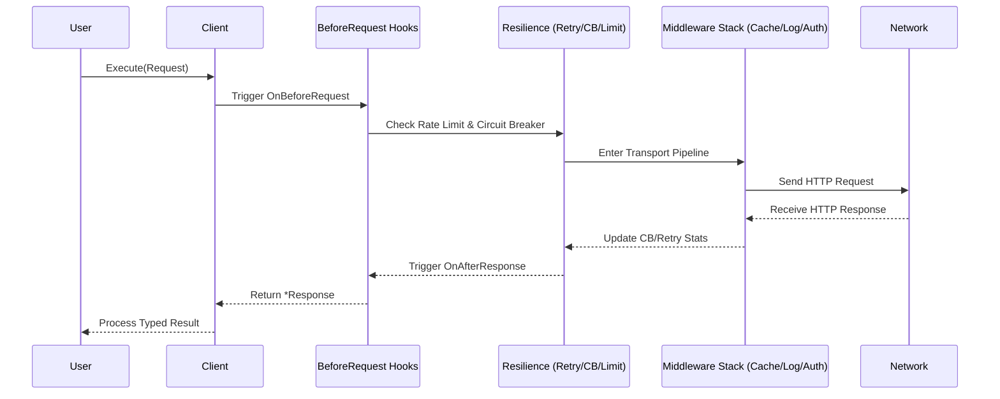

<div align="center">

# 🚀 Relay

**A production-grade, declarative HTTP client for Go with the ergonomics of Python's *requests* and the power of *Resilience4j*.**

[](https://pkg.go.dev/github.com/jhonsferg/relay)
[](https://github.com/jhonsferg/relay/actions)
[](https://codecov.io/gh/jhonsferg/relay)
[](https://goreportcard.com/report/github.com/jhonsferg/relay)
[](LICENSE)

---

**[Installation](#-installation) • [Architecture](#-architecture) • [Quick Start](#-quick-start) • [Detailed Guides](#-detailed-guides) • [Extensions](#-modular-extensions) • [Testing](#-testing-with-relay) • [Performance](#-performance)**

</div>

## 📖 Overview

**Relay** is designed for developers who need more than just `http.Client`. It provides a fluent, batteries-included experience for building resilient distributed systems. It handles retries, circuit breaking, rate limiting, and observability out of the box, allowing you to focus on your business logic.

---

## 🏗 Architecture

### Request/Response Lifecycle

Relay uses a structured pipeline to ensure every request is protected and observed.



---

## 📦 Installation

```bash
go get github.com/jhonsferg/relay
```

Optional extensions:
```bash
go get github.com/jhonsferg/relay/ext/oauth      # OAuth 2.0
go get github.com/jhonsferg/relay/ext/redis      # Redis Cache
go get github.com/jhonsferg/relay/ext/tracing    # OTel Tracing
go get github.com/jhonsferg/relay/ext/sentry     # Sentry Integration
```

---

## ⚡ Quick Start

```go
import "github.com/jhonsferg/relay"

client := relay.New(
    relay.WithBaseURL("https://api.example.com"),
    relay.WithTimeout(10 * time.Second),
)

// Typed JSON decode using Generics
user, resp, err := relay.ExecuteAs[User](client, client.Get("/users/42"))
```

---

## 🔍 Detailed Guides

<details>
<summary><b>🛠 Request Building (Fluent API)</b></summary>

Relay provides a powerful builder for complex requests:

```go
resp, err := client.Post("/upload").
    WithHeader("X-Custom", "value").
    WithQueryParam("version", "v1").
    WithPathParam("id", "42").
    WithJSON(map[string]string{"name": "relay"}).
    WithIdempotencyKey("unique-key-123").
    Execute() // Or use client.Execute(req)
```

**Supported Body Types:**
- `WithJSON(v)`: Marshals to JSON and sets `Content-Type`.
- `WithFormData(map)`: URL-encoded form data.
- `WithMultipart(fields)`: File uploads and mixed parts.
- `WithBody(bytes)`: Raw body.
- `WithBodyReader(reader)`: Streaming body.

</details>

<details>
<summary><b>🛡 Resilience & Reliability</b></summary>

### Exponential Backoff Retries
Automatically retries on network errors or specific HTTP status codes (429, 5xx).

```go
relay.WithRetry(&relay.RetryConfig{
    MaxAttempts:     3,
    InitialInterval: 100 * time.Millisecond,
    MaxInterval:     30 * time.Second,
    Multiplier:      2.0,
    RetryableStatus: []int{429, 503},
})
```

### Circuit Breaker
Protects your system from cascading failures by "tripping" when a service is down.

```go
relay.WithCircuitBreaker(&relay.CircuitBreakerConfig{
    MaxFailures:  5,                // Trip after 5 failures
    ResetTimeout: 60 * time.Second, // Wait before probing recovery
    OnStateChange: func(from, to relay.CircuitBreakerState) {
        log.Printf("Circuit changed: %s -> %s", from, to)
    },
})
```
</details>

<details>
<summary><b>📡 Streaming & Large Payloads</b></summary>

Use `ExecuteStream` for Server-Sent Events (SSE), JSONL, or large file downloads without loading everything into memory.

```go
stream, err := client.ExecuteStream(client.Get("/events"))
if err != nil { ... }
defer stream.Body.Close()

scanner := bufio.NewScanner(stream.Body)
for scanner.Scan() {
    fmt.Println("New Event:", scanner.Text())
}
```
</details>

<details>
<summary><b>📊 Response Timing & Breakdown</b></summary>

Relay provides nanosecond-precision breakdown for every phase of the HTTP request.

```go
resp, _ := client.Execute(req)
t := resp.Timing

fmt.Printf("DNS: %v\n", t.DNSLookup)
fmt.Printf("TCP: %v\n", t.TCPConnection)
fmt.Printf("TLS: %v\n", t.TLSHandshake)
fmt.Printf("TTFB: %v\n", t.ServerProcessing) // Time to First Byte
fmt.Printf("Total: %v\n", t.Total)
```
</details>

---

## 🔌 Modular Extensions

Relay integrates with your existing stack via official extensions:

| Extension | Feature | Highlights |
| :--- | :--- | :--- |
| **Observability** | `ext/tracing` | OpenTelemetry Distributed Tracing |
| | `ext/metrics` | OpenTelemetry Metrics (RPS, Latency, Errors) |
| | `ext/prometheus` | Native Prometheus exporter |
| | `ext/sentry` | Exception & Breadcrumb capture |
| **Auth & Security** | `ext/oauth` | OAuth 2.0 Client Credentials with Auto-Refresh |
| | `ext/sigv4` | AWS Signature Version 4 for AWS Services |
| **Caching** | `ext/redis` | Redis-backed HTTP caching |
| | `ext/memcached` | Memcached-backed HTTP caching |
| **Logging** | `ext/zap` | Uber's Zap adapter |
| | `ext/zerolog` | Zerolog adapter |

---

## 🧪 Testing with Relay

Relay includes a `testutil` package to make testing your integrations a breeze.

```go
import "github.com/jhonsferg/relay/testutil"

func TestMyAPI(t *testing.T) {
    srv := testutil.NewMockServer()
    defer srv.Close()

    // Queue responses
    srv.Enqueue(testutil.MockResponse{
        Status: 200,
        Body:   `{"status":"ok"}`,
    })

    client := relay.New(relay.WithBaseURL(srv.URL()))
    resp, _ := client.Execute(client.Get("/health"))

    // Assert request was made as expected
    req, _ := srv.TakeRequest(time.Second)
    assert.Equal(t, "/health", req.Path)
}
```

---

## 🚀 Performance

Relay is built for high-throughput services:
- **Zero-Allocation Pooling:** Uses `sync.Pool` for internal buffers to reduce GC pressure.
- **Request Coalescing:** Prevents "Thundering Herd" by collapsing concurrent identical requests.
- **Optimized Transport:** Pre-configured connection pooling and HTTP/2 support.

---

## 🤝 Contributing

Contributions are welcome! Please see our [Contributing Guide](CONTRIBUTING.md) for details.

1. Fork the Project
2. Create your Feature Branch (`git checkout -b feature/AmazingFeature`)
3. Commit your Changes (`git commit -m 'feat: add some amazing feature'`)
4. Push to the Branch (`git push origin feature/AmazingFeature`)
5. Open a Pull Request

---

<div align="center">

### License

Distributed under the MIT License. See [LICENSE](LICENSE) for more information.

Built with ❤️ by [jhonsferg](https://github.com/jhonsferg)

</div>
