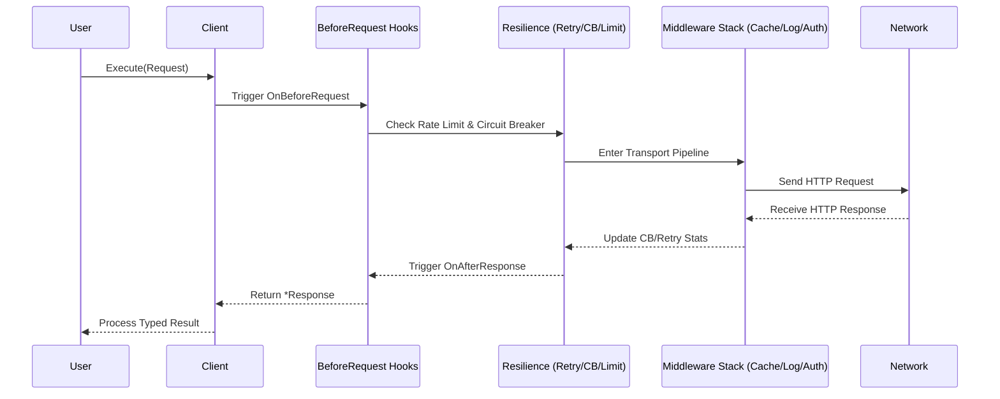
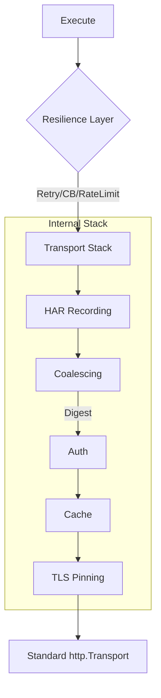

<div align="center">

# 🚀 Relay

**A production-grade, declarative HTTP client for Go with the ergonomics of Python's *requests* and the power of *Resilience4j*.**

[](https://img.shields.io/badge/Go-1.22%2B-00ADD8?style=for-the-badge&logo=go)
[](https://img.shields.io/github/actions/workflows/ci.yml?style=for-the-badge&logo=github)
[](https://codecov.io/gh/jhonsferg/relay)
[](https://goreportcard.com/report/github.com/jhonsferg/relay)
[](LICENSE)

---

**[Quick Start](#-quick-start) • [Architecture](#-architecture) • [Feature Matrix](#-feature-matrix) • [Extensions](#-modular-extensions) • [Examples](./examples)**

</div>

## 📖 Overview

**Relay** is designed for developers who need more than just `http.Client`. It provides a fluent, batteries-included experience for building resilient distributed systems. It handles retries, circuit breaking, rate limiting, and observability out of the box, allowing you to focus on your business logic.

---

## 🏗 Architecture

### Request/Response Lifecycle

The following diagram illustrates how a request flows through the Relay pipeline, from the high-level builder to the wire and back.



### Middleware Pipeline

Relay uses a layered "Onion" architecture for its transport stack.



---

## ⚡ Quick Start

```go
import "github.com/jhonsferg/relay"

func main() {
    // 1. Create a client with sensible defaults
    client := relay.New(
        relay.WithBaseURL("https://api.example.com"),
        relay.WithTimeout(10 * time.Second),
        relay.WithRetry(nil), // Uses default exponential backoff
    )

    // 2. Execute a fluent request
    var user User
    resp, err := relay.ExecuteAs[User](client, 
        client.Get("/users/{id}").
            WithPathParam("id", "42").
            WithQueryParam("active", "true"),
    )

    if err != nil {
        log.Fatal(err)
    }
    fmt.Printf("User: %s (Status: %d)\n", user.Name, resp.StatusCode)
}
```

---

## 🚀 Advanced Usage & Recipes

Relay shines when you combine its features to build industrial-grade integrations.

### 1. The "Resilient Microservice" Pattern
Combine Retries, Circuit Breaker, and Rate Limiting to protect your system and the downstream service.

```go
client := relay.New(
    relay.WithBaseURL("https://unreliable-api.com"),
    // Retry up to 5 times with custom backoff
    relay.WithRetry(&relay.RetryConfig{
        MaxAttempts:     5,
        InitialInterval: 200 * time.Millisecond,
        MaxInterval:     10 * time.Second,
        Multiplier:      2.0,
    }),
    // Open circuit after 10 consecutive failures
    relay.WithCircuitBreaker(&relay.CircuitBreakerConfig{
        MaxFailures:  10,
        ResetTimeout: 30 * time.Second,
    }),
    // Protect downstream with client-side rate limit (50 RPS)
    relay.WithRateLimit(50, 10),
)
```

### 2. Distributed Caching with Redis
Enable transparent HTTP caching using Redis as the shared backend.

```go
import (
    "github.com/redis/go-redis/v9"
    relayredis "github.com/jhonsferg/relay/ext/redis"
)

rdb := redis.NewClient(&redis.Options{Addr: "localhost:6379"})
store := relayredis.NewCacheStore(rdb, "api-cache:")

client := relay.New(
    relay.WithCache(store), // Honors Cache-Control, ETag, and Last-Modified
)
```

### 3. Full Observability Stack (OTel + Sentry + Zap)
Integrate tracing, metrics, error tracking, and structured logging in a single client.

```go
import (
    relaytracing "github.com/jhonsferg/relay/ext/tracing"
    relaymetrics "github.com/jhonsferg/relay/ext/metrics"
    relaysentry "github.com/jhonsferg/relay/ext/sentry"
    relayzap "github.com/jhonsferg/relay/ext/zap"
)

client := relay.New(
    relaytracing.WithTracing(nil, nil),      // W3C TraceContext propagation
    relaymetrics.WithOTelMetrics(nil),       // Standard HTTP metrics
    relaysentry.WithSentry(sentryHub),       // Automatic error & 5xx capture
    relay.WithLogger(relayzap.NewAdapter(z)), // Structured logs for every req
)
```

### 4. Smart Concurrency: Batch & Coalescing
Use `ExecuteBatch` for parallel fan-out and `Coalescing` to prevent "thundering herd" issues.

```go
// Enable Coalescing: concurrent identical GETs will only trigger ONE network call
client := relay.New(relay.WithRequestCoalescing())

// Execute multiple requests in parallel with bounded concurrency (3 workers)
reqs := []*relay.Request{
    client.Get("/resource/1"),
    client.Get("/resource/2"),
    client.Get("/resource/3"),
}

results := client.ExecuteBatch(ctx, reqs, 3)
```

### 5. Secure AWS & API Integrations
Sign requests for AWS services or use certificate pinning for high-security APIs.

```go
import relaysigv4 "github.com/jhonsferg/relay/ext/sigv4"

client := relay.New(
    // AWS SigV4 Signing
    relaysigv4.WithSigV4(relaysigv4.Config{
        Region: "us-east-1",
        Service: "execute-api",
    }),
    // SHA-256 Certificate Pinning
    relay.WithCertificatePinning([]string{
        "sha256/fba6f...=", // Primary CA
        "sha256/7453f...=", // Backup CA
    }),
)
```

---

## 🛠 Feature Matrix

| Category | Feature | Highlights |
| :--- | :--- | :--- |
| **🛡 Resilience** | Retry & Backoff | Exponential + Jitter + `Retry-After` support |
| | Circuit Breaker | Closed ↔ Open ↔ Half-Open with callbacks |
| | Rate Limiting | Client-side Token Bucket (Burst + RPS) |
| **📦 Data** | Caching | RFC 7234 with pluggable backends (Redis/Memcached) |
| | Coalescing | Deduplicate concurrent identical GET/HEAD calls |
| | Generics | Type-safe JSON decoding with `ExecuteAs[T]` |
| **📡 Ops** | Observability | Detailed timing (DNS, TCP, TLS, TTFB) + OTel |
| | Logging | Pluggable structured logging (Slog, Zap, Zerolog) |
| | HAR Capture | Export traffic to HAR 1.2 for debugging |
| **🧪 Security** | TLS Pinning | SHA-256 certificate pinning |
| | Idempotency | Auto-inject `X-Idempotency-Key` on retries |

---

## 🔌 Modular Extensions

Relay is highly modular. Add only what you need to keep your binary lean.

| Extension | Purpose | Command |
| :--- | :--- | :--- |
| `ext/oauth` | OAuth 2.0 Client Credentials | `go get github.com/jhonsferg/relay/ext/oauth` |
| `ext/tracing` | OpenTelemetry Tracing | `go get github.com/jhonsferg/relay/ext/tracing` |
| `ext/metrics` | OpenTelemetry Metrics | `go get github.com/jhonsferg/relay/ext/metrics` |
| `ext/redis` | Redis Cache Backend | `go get github.com/jhonsferg/relay/ext/redis` |
| `ext/sentry` | Sentry Error Capture | `go get github.com/jhonsferg/relay/ext/sentry` |
| `ext/zap` | Zap Logger Adapter | `go get github.com/jhonsferg/relay/ext/zap` |

---

## 📊 Observability

Every response includes a detailed breakdown of the request timing, allowing you to pinpoint bottlenecks instantly.

```go
resp, _ := client.Execute(req)
t := resp.Timing

fmt.Printf("DNS: %v | TCP: %v | TLS: %v | TTFB: %v | Total: %v\n",
    t.DNSLookup, t.TCPConnection, t.TLSHandshake, t.ServerProcessing, t.Total)
```

---

## 🤝 Contributing

Contributions are welcome! Please see our [Contributing Guide](CONTRIBUTING.md) for details.

1. Fork the Project
2. Create your Feature Branch (`git checkout -b feature/AmazingFeature`)
3. Commit your Changes (`git commit -m 'feat: add some amazing feature'`)
4. Push to the Branch (`git push origin feature/AmazingFeature`)
5. Open a Pull Request

---

<div align="center">

### License

Distributed under the MIT License. See [LICENSE](LICENSE) for more information.

Built with ❤️ by [jhonsferg](https://github.com/jhonsferg)

</div>
