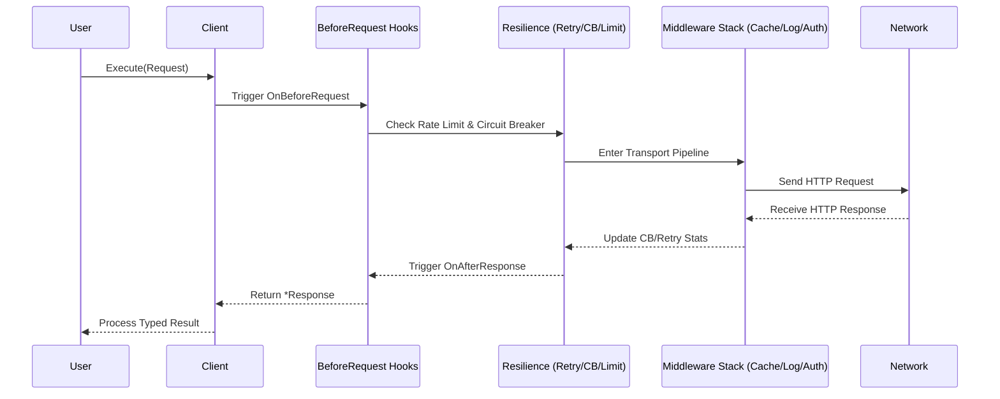

<div align="center">

# 🚀 Relay

**A production-grade, declarative HTTP client for Go with the ergonomics of Python's *requests* and the power of *Resilience4j*.**

[](https://pkg.go.dev/github.com/jhonsferg/relay)
[](https://github.com/jhonsferg/relay/actions)
[](https://codecov.io/gh/jhonsferg/relay)
[](https://goreportcard.com/report/github.com/jhonsferg/relay)
[](LICENSE)

---

**[Installation](#-installation) • [Architecture](#-architecture) • [Quick Start](#-quick-start) • [Detailed Guides](#-detailed-guides) • [Extensions](#-extension-ecosystem) • [Testing](#-testing-with-relay) • [Performance](#-performance)**

</div>

## 📖 Overview

**Relay** is designed for developers who need more than just `http.Client`. It provides a fluent, batteries-included experience for building resilient distributed systems. It handles retries, circuit breaking, rate limiting, and observability out of the box, allowing you to focus on your business logic.

---

## 🏗 Architecture

### Request/Response Lifecycle

Relay uses a structured pipeline to ensure every request is protected and observed.



---

## 📦 Installation

```bash
go get github.com/jhonsferg/relay
```

Optional extensions:

```bash
go get github.com/jhonsferg/relay/ext/oauth      # OAuth 2.0
go get github.com/jhonsferg/relay/ext/redis      # Redis Cache
go get github.com/jhonsferg/relay/ext/tracing    # OTel Tracing
go get github.com/jhonsferg/relay/ext/sentry     # Sentry Integration
```

---

## ⚡ Quick Start

```go
import "github.com/jhonsferg/relay"

client := relay.New(
    relay.WithBaseURL("https://api.example.com"),
    relay.WithTimeout(10 * time.Second),
)

// Typed JSON decode using Generics
user, resp, err := relay.ExecuteAs[User](client, client.Get("/users/42"))
```

---

## 🔍 Detailed Guides

### 🛠 Request Building (Fluent API)

Relay provides a powerful builder for complex requests:

```go
resp, err := client.Post("/upload").
    WithHeader("X-Custom", "value").
    WithQueryParam("version", "v1").
    WithPathParam("id", "42").
    WithJSON(map[string]string{"name": "relay"}).
    WithIdempotencyKey("unique-key-123").
    Execute() // Or use client.Execute(req)
```

**Supported Body Types:**

- **JSON:** `WithJSON(v)` marshals to JSON and sets `Content-Type`.
- **Form:** `WithFormData(map)` for URL-encoded form data.
- **Multipart:** `WithMultipart(fields)` for file uploads and mixed parts.
- **Raw:** `WithBody(bytes)` or `WithBodyReader(reader)`.

### 🛡 Resilience & Reliability

#### Exponential Backoff Retries
Automatically retries on network errors or specific HTTP status codes (429, 5xx).

```go
relay.WithRetry(&relay.RetryConfig{
    MaxAttempts:     3,
    InitialInterval: 100 * time.Millisecond,
    MaxInterval:     30 * time.Second,
    Multiplier:      2.0,
    RetryableStatus: []int{429, 503},
})
```

#### Circuit Breaker
Protects your system from cascading failures by "tripping" when a service is down.

```go
relay.WithCircuitBreaker(&relay.CircuitBreakerConfig{
    MaxFailures:  5,                // Trip after 5 failures
    ResetTimeout: 60 * time.Second, // Wait before probing recovery
    OnStateChange: func(from, to relay.CircuitBreakerState) {
        log.Printf("Circuit changed: %s -> %s", from, to)
    },
})
```

### 📡 Streaming & Large Payloads

Use `ExecuteStream` for Server-Sent Events (SSE), JSONL, or large file downloads without loading everything into memory.

```go
stream, err := client.ExecuteStream(client.Get("/events"))
if err != nil { ... }
defer stream.Body.Close()

scanner := bufio.NewScanner(stream.Body)
for scanner.Scan() {
    fmt.Println("New Event:", scanner.Text())
}
```

### 📊 Response Timing & Breakdown

Relay provides nanosecond-precision breakdown for every phase of the HTTP request.

```go
resp, _ := client.Execute(req)
t := resp.Timing

fmt.Printf("DNS: %v | TCP: %v | TLS: %v | TTFB: %v | Total: %v\n",
    t.DNSLookup, t.TCPConnection, t.TLSHandshake, t.ServerProcessing, t.Total)
```

---

## 🔌 Extension Ecosystem

Relay is designed to be lean. The core has zero external dependencies. Use these official extensions to integrate with popular tools and services.

### 🛡 Observability & Monitoring

#### OpenTelemetry (Tracing & Metrics)
Full distributed tracing and automated metrics for your HTTP calls.

- **Package:** `github.com/jhonsferg/relay/ext/tracing` & `ext/metrics`
- **Use Case:** Track request latency in Jaeger/Zipkin and RPS/Error rates in Prometheus.

```go
import (
    relaytracing "github.com/jhonsferg/relay/ext/tracing"
    relaymetrics "github.com/jhonsferg/relay/ext/metrics"
)

client := relay.New(
    relaytracing.WithTracing(nil, nil), // Automatic W3C propagation
    relaymetrics.WithOTelMetrics(nil),  // Records duration, request size, etc.
)
```

#### Sentry Integration
Automatically capture 5xx errors and network failures as Sentry events with full HTTP context.

- **Package:** `github.com/jhonsferg/relay/ext/sentry`
- **Use Case:** Get notified in Sentry when your downstream dependencies fail.

```go
import relaysentry "github.com/jhonsferg/relay/ext/sentry"

client := relay.New(
    relaysentry.WithSentry(sentry.CurrentHub()),
    relaysentry.WithCaptureClientErrors(true), // Optional: capture 4xx too
)
```

#### Prometheus Native
Direct Prometheus metrics without needing the full OpenTelemetry SDK.

- **Package:** `github.com/jhonsferg/relay/ext/prometheus`

```go
import relayprom "github.com/jhonsferg/relay/ext/prometheus"

client := relay.New(
    relayprom.WithPrometheus(prometheus.DefaultRegisterer, "my_app"),
)
```

### 💾 Advanced Caching

#### Redis & Memcached Backends
Offload your HTTP cache to a distributed store to share cached responses across multiple microservice instances.

- **Packages:** `github.com/jhonsferg/relay/ext/redis`, `ext/memcached`

```go
import relayredis "github.com/jhonsferg/relay/ext/redis"

store := relayredis.NewCacheStore(redisClient, "relay-cache:")
client := relay.New(relay.WithCache(store))
```

### 🔐 Security & Cloud

#### AWS SigV4 Signing
Seamlessly call any AWS service (S3, DynamoDB, Lambda) by automatically signing requests with your credentials.

- **Package:** `github.com/jhonsferg/relay/ext/sigv4`

```go
import relaysigv4 "github.com/jhonsferg/relay/ext/sigv4"

client := relay.New(
    relaysigv4.WithSigV4(relaysigv4.Config{
        Region: "us-east-1",
        Service: "s3",
    }),
)
```

#### OAuth 2.0 Client Credentials
Handle M2M (Machine-to-Machine) authentication with automatic token fetching and background refreshing.

- **Package:** `github.com/jhonsferg/relay/ext/oauth`

```go
import relayoauth "github.com/jhonsferg/relay/ext/oauth"

client := relay.New(
    relayoauth.WithClientCredentials(relayoauth.Config{
        TokenURL: "https://auth.provider.com/token",
        ClientID: "...",
        ClientSecret: "...",
    }),
)
```

### 📝 Structured Logging

#### Zap & Zerolog Adapters
Bridge Relay's internal logging to your favorite high-performance logging library.

- **Packages:** `github.com/jhonsferg/relay/ext/zap`, `ext/zerolog`

```go
import relayzap "github.com/jhonsferg/relay/ext/zap"

client := relay.New(
    relay.WithLogger(relayzap.NewAdapter(zapLogger)),
)
```

### 🛠 Resilience Utilities

#### Jitterbug (Advanced Backoff)
Alternative retry strategies like "Decorrelated Jitter" for better load distribution during recovery.

- **Package:** `github.com/jhonsferg/relay/ext/jitterbug`

```go
import relayjitter "github.com/jhonsferg/relay/ext/jitterbug"

client := relay.New(
    relay.WithRetry(&relay.RetryConfig{
        Backoff: relayjitter.NewDecorrelatedJitter(100ms, 30s),
    }),
)
```

#### Brotli Decompression
Transparent support for `br` content encoding, saving bandwidth on modern APIs.

- **Package:** `github.com/jhonsferg/relay/ext/brotli`

```go
import relaybr "github.com/jhonsferg/relay/ext/brotli"

client := relay.New(relaybr.WithBrotliDecompression())
```

---

## 🧪 Testing with Relay

Relay incluye un paquete `testutil` para facilitar el mockeo de servidores HTTP en tus tests unitarios.

```go
import "github.com/jhonsferg/relay/testutil"

func TestMyAPI(t *testing.T) {
    srv := testutil.NewMockServer()
    defer srv.Close()

    // Queue responses
    srv.Enqueue(testutil.MockResponse{
        Status: 200,
        Body:   `{"status":"ok"}`,
    })

    client := relay.New(relay.WithBaseURL(srv.URL()))
    resp, _ := client.Execute(client.Get("/health"))

    // Assert request was made as expected
    req, _ := srv.TakeRequest(time.Second)
    assert.Equal(t, "/health", req.Path)
}
```

---

## 🚀 Performance

Relay está construido para servicios de alto rendimiento:

- **Zero-Allocation Pooling:** Utiliza `sync.Pool` para buffers internos, reduciendo la presión sobre el GC.
- **Request Coalescing:** Evita el "Thundering Herd" colapsando peticiones idénticas concurrentes.
- **Optimized Transport:** Pool de conexiones pre-configurado y soporte nativo para HTTP/2.

---

## 🤝 Contributing

Contributions are welcome! Please see our [Contributing Guide](CONTRIBUTING.md) for details.

1. Fork the Project
2. Create your Feature Branch (`git checkout -b feature/AmazingFeature`)
3. Commit your Changes (`git commit -m 'feat: add some amazing feature'`)
4. Push to the Branch (`git push origin feature/AmazingFeature`)
5. Open a Pull Request

---

<div align="center">

### License

Distributed under the MIT License. See [LICENSE](LICENSE) for more information.

Built with ❤️ by [jhonsferg](https://github.com/jhonsferg)

</div>
